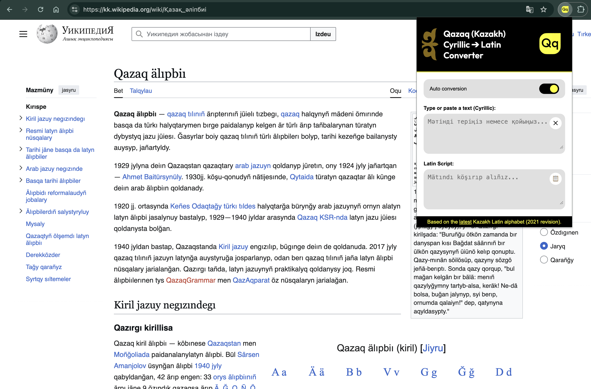
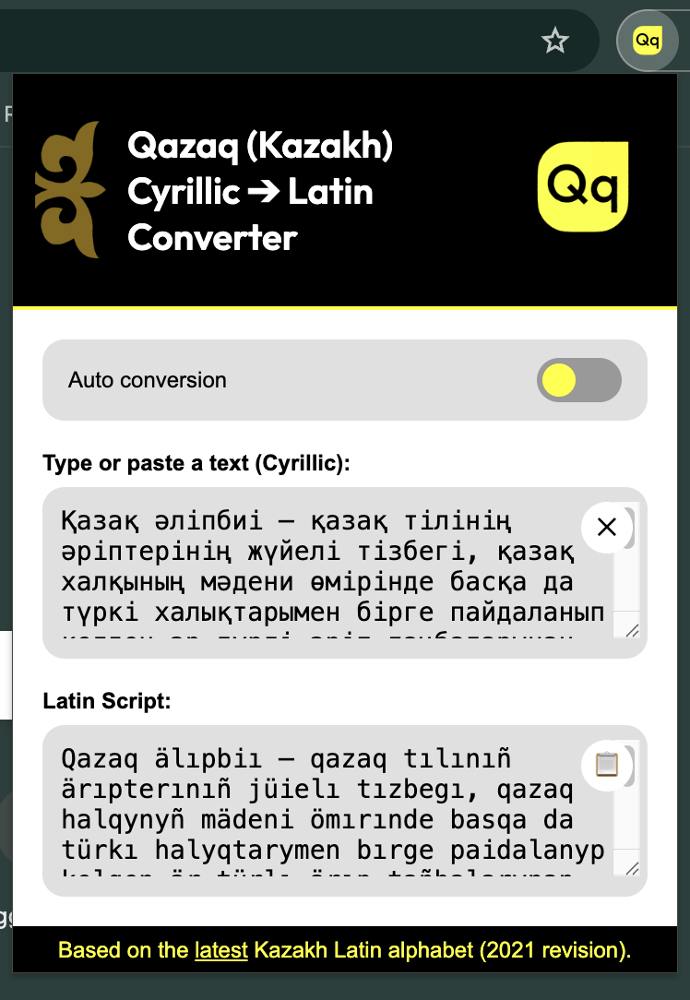

  

# Qazaq (Kazakh) Latin Converter
### Chrome Extension for converting Kazakh Cyrillic → Latin dynamically
> Based on the [latest](https://primeminister.kz/ru/news/a-mamin-provel-zasedanie-nackomissii-po-perevodu-alfavita-kazahskogo-yazyka-na-latinskuyu-grafiku-280497) Kazakh Latin alphabet (2021 revision).

### 📖 Example Usage

1. Install the extension in your Chrome browser.
2. Click the extension icon to toggle between Cyrillic and Latin scripts on any webpage.

### 🔄 Auto Conversion

  

### 📝 Manual Conversion (via Popup)

  

## 🤝 Contributing
Contributions, issues, and feature requests are welcome!  
Feel free to fork the repo and submit a pull request.

